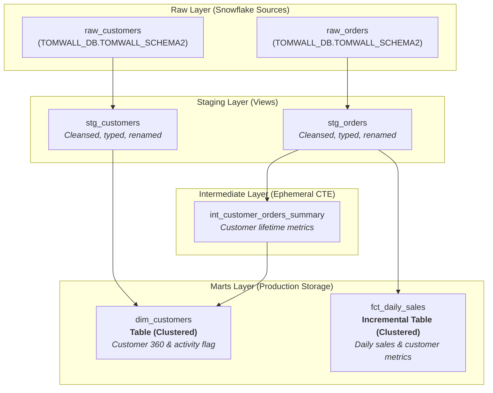

# Snowflake + dbt End-to-End Analytics Pipeline

A production-ready dbt (data build tool) project demonstrating an end-to-end data transformation pipeline on Snowflake. The project follows analytics engineering best practices, including layered dimensional modeling (Staging, Intermediate, Marts), ephemeral CTEs, clustering, incremental table loads, and automated data testing.

---

## Data Pipeline Architecture & Lineage



---

## Project Structure

```text
snowflake_dbt_end_to_end/
├── .gitignore                      # Excludes secrets, target/, dbt_packages/, logs, and virtual environments
├── dbt_project.yml                 # Core dbt configuration & model defaults
├── packages.yml                    # dbt hub dependencies (dbt_utils, snowflake_utils)
├── profiles.yml.example            # Snowflake connection template
├── DEMO_WALKTHROUGH.md             # Presenter cheat sheet & 10-minute live demo script
├── README.md                       # Project documentation & runbook
├── models/                         # Native Snowflake dbt models
│   ├── staging/
│   │   ├── src_ecommerce.yml       # Source definitions & data quality tests (unique, not_null, relationships)
│   │   ├── stg_customers.sql       # Type casting, column renaming, whitespace trimming
│   │   └── stg_orders.sql          # Order casting, status standardization, numeric rounding
│   ├── intermediate/
│   │   └── int_customer_orders_summary.sql # Ephemeral CTE calculating lifetime orders & spend
│   └── marts/
│       ├── dim_customers.sql       # Clustered dimension table combining customer profile & purchase history
│       └── fct_daily_sales.sql     # Clustered incremental fact table aggregating daily revenue & orders
└── translated/                     # BigQuery-translated models (for Snowflake-to-BigQuery migration demos)
    ├── staging/
    ├── intermediate/
    └── marts/
```

---

## Environment Setup

### 1. Create Virtual Environment & Install dbt

```bash
# Create and activate Python virtual environment
python3 -m venv .venv
source .venv/bin/activate

# Install dbt Snowflake adapter
pip install dbt-snowflake
```

### 2. Configure Snowflake Connection (`profiles.yml`)

The project uses the `snowflake_profile` profile configured in [dbt_project.yml](dbt_project.yml). Copy the template to your dbt configuration directory:

```bash
mkdir -p ~/.dbt
cp profiles.yml.example ~/.dbt/profiles.yml
```

Edit `~/.dbt/profiles.yml` with your Snowflake account details:

```yaml
snowflake_profile:
  target: dev
  outputs:
    dev:
      type: snowflake
      account: <your_account_identifier>   # e.g., xy12345.us-central1.gcp or org-account
      user: CE_TEST
      password: <your_password>
      role: SYSADMIN
      database: TOMWALL_DB
      warehouse: DWH_MIGRATIONS
      schema: TOMWALL_SCHEMA2
      threads: 4
      client_session_keep_alive: False
```

---

## Running the Pipeline

### Step 1: Verify Connection & Install Packages
```bash
# Verify connection to Snowflake
dbt debug

# Download and install required dbt packages (dbt_utils, snowflake_utils)
dbt deps
```

### Step 2: Build Models & Execute Transformations
```bash
# Compile queries without executing (dry run)
dbt compile

# Build and execute all models
dbt run

# Run end-to-end (build models + execute tests in DAG order)
dbt build
```

### Step 3: Run Data Quality Tests
```bash
# Execute all schema and integrity tests
dbt test
```

### Step 4: Selective Runs
```bash
# Run only staging models
dbt run --select staging

# Run only marts (tables & incremental)
dbt run --select marts

# Run a model and its upstream dependencies
dbt run --select +dim_customers

# Run a model and downstream dependencies
dbt run --select stg_orders+

# Force full rebuild of the incremental fact table
dbt run --select fct_daily_sales --full-refresh
```

### Step 5: Interactive Documentation & Lineage
```bash
# Generate documentation metadata
dbt docs generate

# Serve documentation and lineage DAG locally
dbt docs serve
```

---

## Data Modeling Features Highlighted

- **Layered Architecture**: Clean separation between raw sources, staging transformations, intermediate business logic, and dimensional marts.
- **Ephemeral Materialization**: `int_customer_orders_summary` uses `ephemeral` materialization, interpolating directly into downstream queries as a reusable CTE without creating physical Snowflake objects.
- **Incremental Loading**: `fct_daily_sales` uses `incremental` materialization with a 3-day lookback window (`dateadd('day', -3, ...)`), minimizing warehouse compute costs on daily updates.
- **Snowflake Clustering**: Clustered on high-cardinality join and filter keys (`customer_id`, `sales_date`) for optimal micro-partition pruning.
- **Data Integrity Tests**: Validates uniqueness, non-nullability, and referential integrity (`relationships`) across customer and order sources.

---

## 🎤 Presenting This Project (Live Demo)

If you are presenting this repository for a customer or internal demo, refer to the **[Demo Walkthrough & Presenter Guide](DEMO_WALKTHROUGH.md)** for:
- 10-minute timed presentation script
- Talking points for each transformation layer
- Queries to run in the Snowflake UI side-by-side
- Presenter Q&A cheat sheet

---

## 🚀 Running BigQuery Translated Models (`translated/`)

The `translated/` directory is configured as a standalone dbt project containing BigQuery-compatible GoogleSQL models migrated from the Snowflake codebase.

### 1. Install dbt BigQuery Adapter
```bash
pip install dbt-bigquery
```

### 2. Authenticate to Google Cloud
Authenticate using Application Default Credentials (ADC):
```bash
gcloud auth application-default login
```

### 3. Add `bigquery_profile` to `~/.dbt/profiles.yml`
```yaml
bigquery_profile:
  target: dev
  outputs:
    dev:
      type: bigquery
      method: oauth
      project: <your_gcp_project_id>    # e.g., cloud-professional-services
      dataset: <your_target_dataset>    # BigQuery dataset where models will be built
      threads: 4
      location: US                      # e.g., US, EU, us-central1
      timeout_seconds: 300
      priority: interactive
```

### 4. Configure Raw Source Variables
The BigQuery staging sources dynamically reference your source dataset via environment variables:
```bash
export DBT_BQ_PROJECT="<gcp_project_holding_raw_data>"
export DBT_BQ_DATASET="<dataset_holding_raw_customers_and_orders>"
```

### 5. Execute BigQuery Transformations
Run dbt targeting the `translated` project directory:
```bash
# Verify BigQuery connection
dbt debug --project-dir translated

# Compile to raw BigQuery SQL
dbt compile --project-dir translated

# Execute transformations in BigQuery
dbt run --project-dir translated

# Run data quality tests in BigQuery
dbt test --project-dir translated

# Or run models and tests end-to-end
dbt build --project-dir translated
```
*(Alternatively, you can `cd translated` and run standard `dbt run`, `dbt test`, etc.)*


